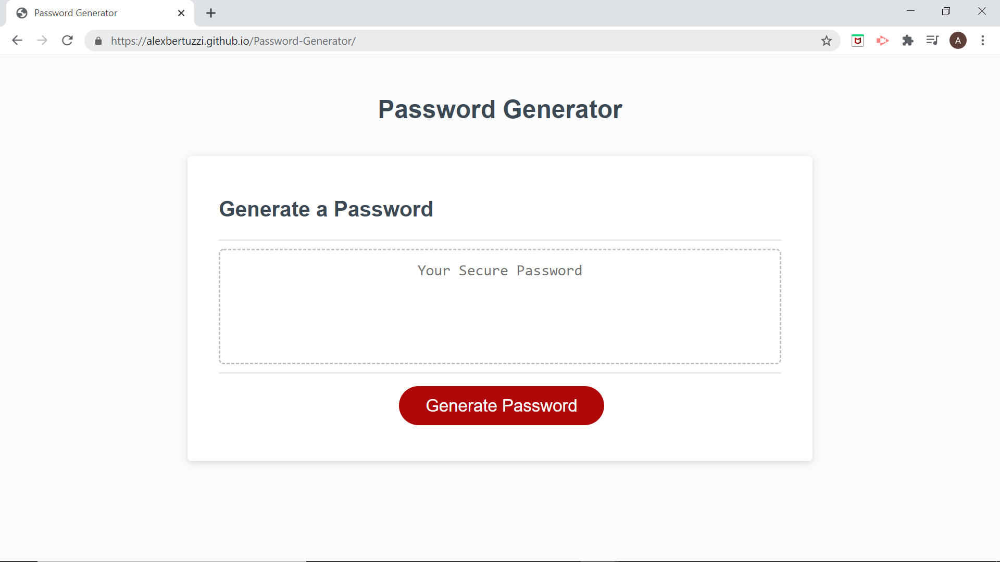

# Password Generator
This project utilizes prompts to allow the user to choose the number of characters, type of characters (number, letter, symbols), and case (upper and lower).
When all prompts have been answered, javascript it utilized to compile all of the charater options from the users choices into one array and then chooses random characters until the length of the password has been met.

Check out the deployed appication here: https://alexbertuzzi.github.io/Password-Generator/

